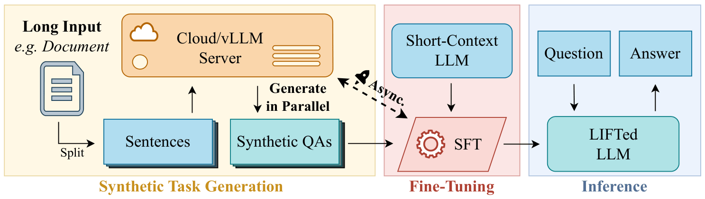
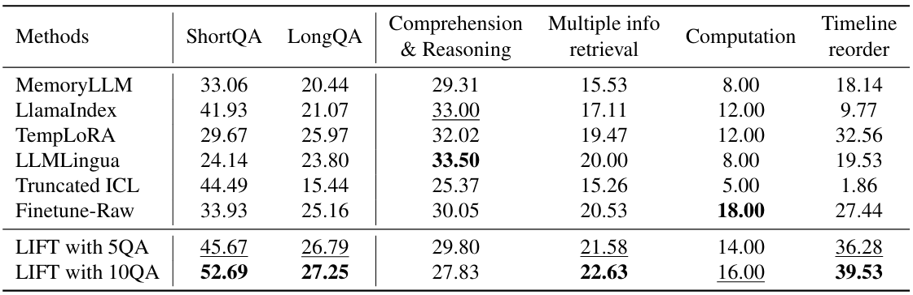
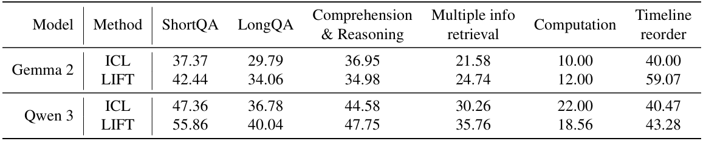
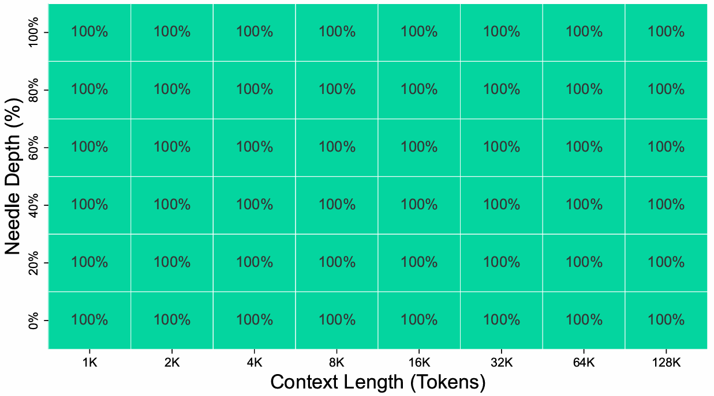
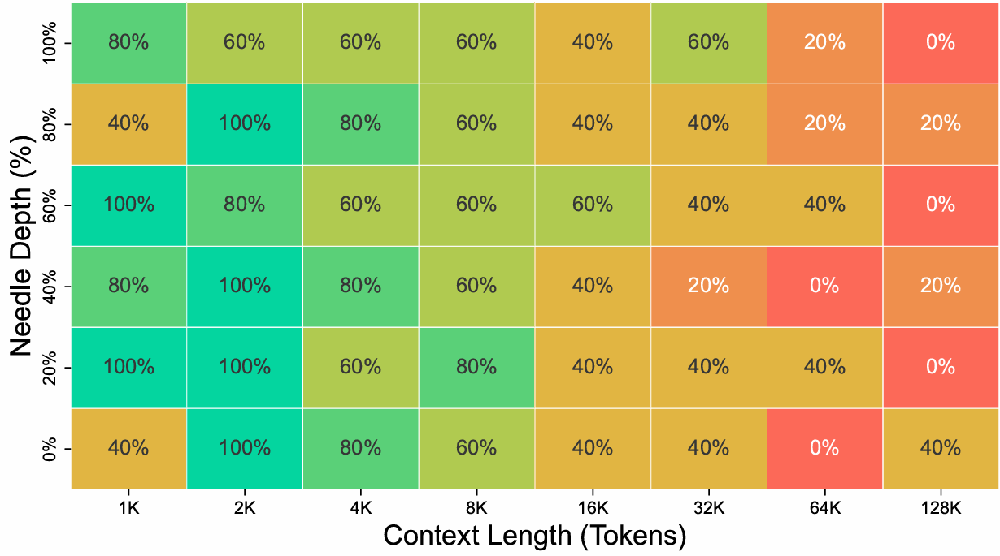
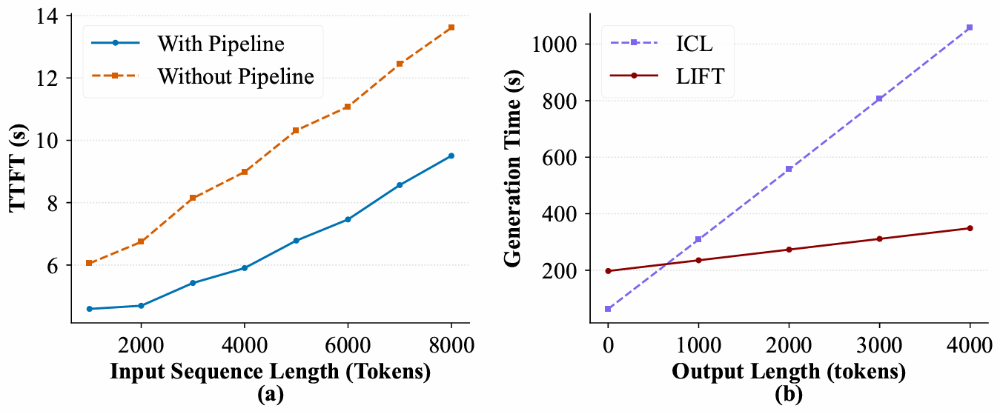

<div align="center">

# LIFT: Long-Input Fine-Tuning

**The official repository of "[LIFT: A Novel Framework for Enhancing Long-Context Understanding of LLMs via Long Input Fine-Tuning](https://arxiv.org/abs/2502.14644)"**

</div>

## 📌 Overview



Long context understanding is often limited by context window sizes and the quadratic computational complexity of the self-attention mechanism. Rather than endlessly extending the context window, **LIFT** (**L**ong-**I**nput **F**ine-**T**uning) stores and absorbs long inputs directly into the model's parameters.

In contrast to conventional methods fine-tuning LLMs on raw contexts, we propose to automatically genereate synthetic tasks and fine-tune LLMs on them. By fine-tuning long inputs into parameters, LIFT allows short-context LLMs to answer questions even when the required information is not provided in the context during inference. Moreover, we implement a highly optimized pipeline to accommodate the additional cost of fine-tuning, making LIFT a practical algorithm for deployment.

Key Advantages:

- **Efficient Decoding**: Eliminates the need to compute attention across the entire input sequence, maintaining the decoding speed of a short-context LLM.
- **Unbounded Input Length**: Since knowledge is stored in parameters, the effective input length becomes unbounded compared to traditional ICL.
- **Deep Comprehension**: Moves beyond mere memorization by leveraging LLM-generated synthetic tasks (QA pairs) to enhance comprehension of long contexts.

## 📦 Installation & Usage

### Set Up Environment 

1. Create a conda environment with Python 3.11:
    ```shell
    conda create -n lift python=3.11
    ```
2. Install Pytorch first. Please follow the instructions on Pytorch website to install `torch==2.7.1`.
3. Install LIFT package and its dependencies:
    ```shell
    pip install -e .
    ```
4. Install `en_core_web_sm` for spacy. Standard installation method is `python -m spacy download en_core_web_sm`. If you encounter connection issues, you can visit https://spacy.io/models/en#en_core_web_sm to download it manually.

:warning: NOTE: We include vLLM in the dependencies of the LIFT package. It is used to deploy a local model for synthetic task generation. If you find it incompatible with your hardware, consider remove this dependency from `setup.py` and use DeepSeek backend instead.

### Apply LIFT to Your Model!

LIFT package mainly wraps the data generation process, while the training process is handled by `transformers`. We use `accelerate` for data-parallel training. Please refer to `example.ipynb` for the detailed instruction to apply LIFT to your model.

## 🚀 Performance

- **LooGLE Benchmark**: LooGLE benchmark is a challenging long-context benchmark. LIFT consistently outperforms all the baselines. Moreover, LIFT generalizes to foundation models including Llama-3, Qwen-3, and Gemma-2.
  <div style="text-align: center; margin-top: 10px;">
  
  <p><i>Performance of LIFT and the baselines on LooGLE based on Llama 3.</i></p>
  
  <p><i>Performance of LIFT and the baselines on LooGLE based on Qwen 3 and Gemma 2.</i></p>
  </div>

- **Needle In A Haystack (NIAH)**: LIFT achieves **perfect accuracy** (100%) on the NIAH benchmark; in contrast, the baseline where the model is fine-tuned on raw context performs poorly.
  <div style="text-align: center; margin-top: 10px;">
  
  <p><i>Performance of LIFT on NIAH.</i></p>
  <div style="text-align: center; margin-top: 10px;">
  
  <p><i>Performance of the baseline on NIAH.</i></p>
  </div>

- **Efficiency**: With the highly optimized pipeline, LIFT reduces Time to First Token (TTFT) to **less than 10 seconds** for 8k context and significantly reduces the average time per token with inputs longer than 32K tokens.
  <div style="text-align: center; margin-top: 10px;">
  
  </div>
  <i>(a) Time to first token (TTFT) across varying input lengths, comparing performance with and without the LIFT asynchronous pipeline. (b) Total generation time relative to output token length for a fixed input length of 128K.</i>


---

## 📄 Citation

If you find LIFT useful in your research, please cite the paper:

```bibtex
@misc{mao2026liftnovelframeworkenhancing,
      title={LIFT: A Novel Framework for Enhancing Long-Context Understanding of LLMs via Long Input Fine-Tuning}, 
      author={Yansheng Mao and Yufei Xu and Jiaqi Li and Fanxu Meng and Haotong Yang and Zilong Zheng and Xiyuan Wang and Muhan Zhang},
      year={2026},
      eprint={2502.14644},
      archivePrefix={arXiv},
      primaryClass={cs.CL},
      url={https://arxiv.org/abs/2502.14644}, 
}
```
